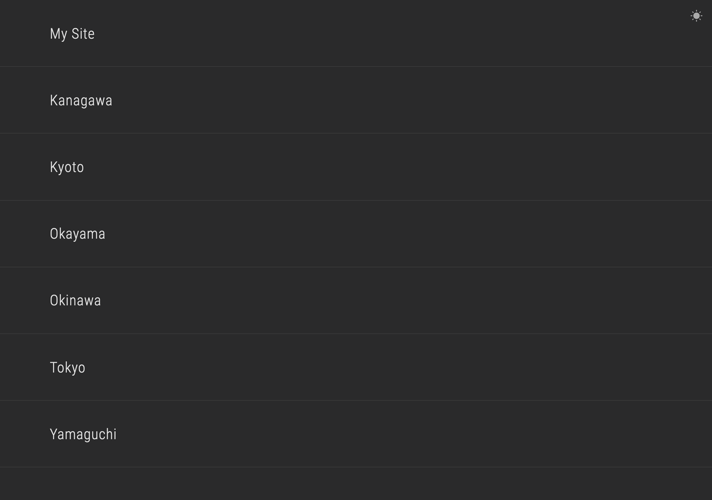
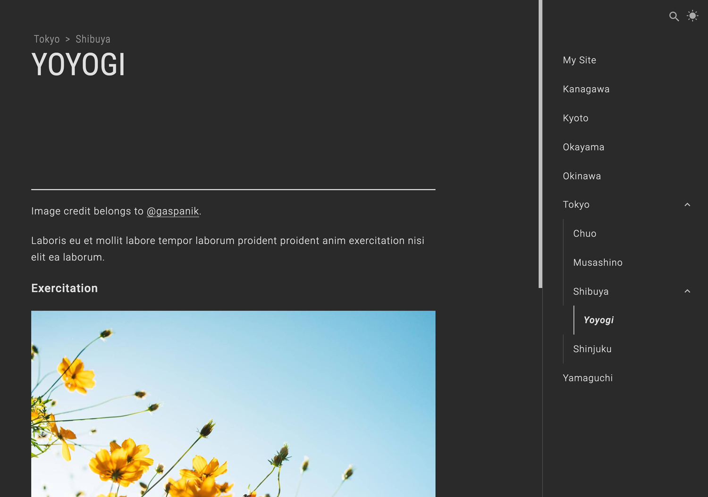
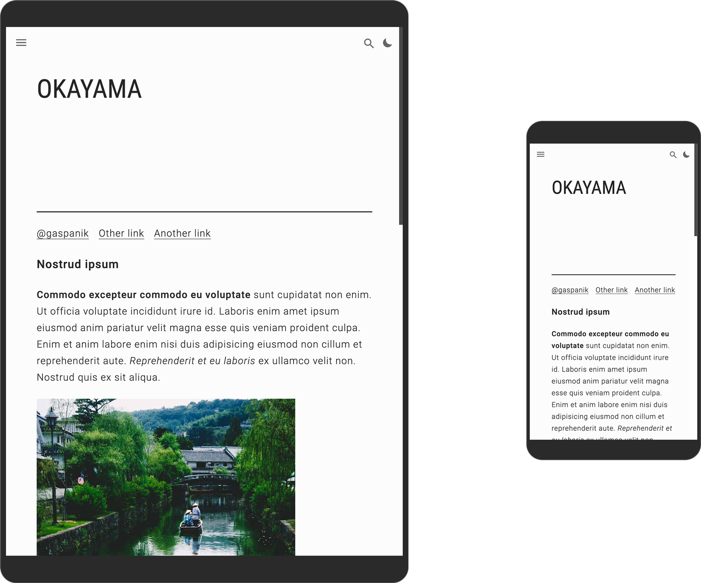
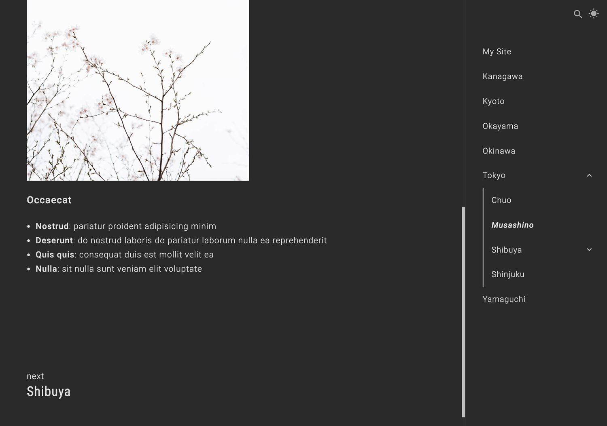
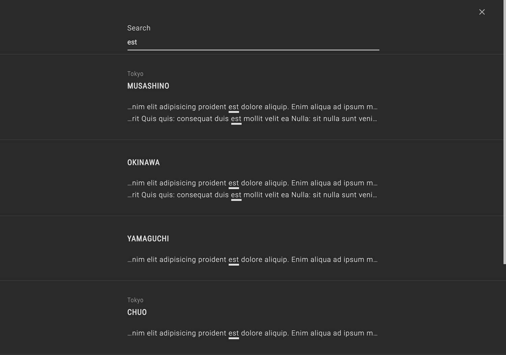

# Tamachi (Gatsby)

[Demo](https://garciaalvaro.github.io/tamachi-gatsby)

This project is a documentation/blogging Gatsby site built in TypeScript using React, Stylus for the CSS and MDX for the Markdown content.

---

## Installation

From the root directory install the dependencies running: `npm install`

## Development

- Start the development server: `npm start`
- When the server is ready visit http://localhost:3000 in your browser

## Production

- Build the production files into the public folder: `npm run build`
- When the files are ready start the server: `npm run serve`
- Visit http://localhost:3000 in your browser

---

## Screenshots







---

## Content

The project comes with a predefined content folder `content-demo`, that can be used as an example of how to set your own content.
To use your own content simply add a `content` folder in the root of the project, with a structure like the `content-demo` one. When the project is built it will read the content from this custom folder instead of the _demo_ one. The idea behind it is to keep the non-content code up to date with this repository and be able to have custom content.

Please notice that the `content` folder is included in the `.gitignore` file, so it will not be tracked. You will probably want to create a different repository for this folder.

The `content` folder needs the following elements:

### A /pages folder

This folder contains the pages of the site. To see an example of how this folder should look, check the `content-demo` folder. Each page needs a `title` and an optional `menu_title` which will be used instead of the title in the menu.

#### Page

Pages are created from folders with an `index.mdx` file, inside `content/pages`.

For example, from `content/pages/page-1/index.mdx` a page will be created in the path `http://localhost:3000/page-1`.

#### Nested Page

Nested pages are created from folders with an `index.mdx` file, inside another page in `content/pages`.

For example, from `content/pages/page-1/sub-page/index.mdx` a page will be created in the path `http://localhost:3000/page-1/sub-page`.

### A /pages/home/index.mdx page

This page will be used for the home of the site. It needs a `title` and a `pages` array which includes the pages id that the home will link to. Check `content-demo/pages/home/index.mdx` to see an example.

### A config.js configuration file

This file defines the variables used in the project. It needs to export an object with the following properties:

```js
module.exports = {
	lang: "en", // language of the site (the lang tag from the <html> element)
	name: "tamachi-gatsby", // Page name
	description: "Gatsby site for Documentation or Blogging",

	// The following parameters are for the Gatsby manifest plugin
	// https://www.gatsbyjs.com/plugins/gatsby-plugin-manifest/
	short_name: "tamachi-gatsby",
	start_url: "/",
	background_color: "#fc0",
	theme_color: "#fc0",
	display: "standalone",
	icon: "content-demo/assets/icon.png", // Path is relative to the root of the site

	// Labels used in the site
	labels: {
		page_not_found_title: "Oops! That page can't be found",
		page_not_found_body:
			"It looks like nothing was found at this location. Maybe try one of the links in the sidebar or a search?",
		noscript:
			"This site needs to have JavaScript active to work correctly.",
	},
	use_breadcrumbs: true, // Breadcrumbs in the top of the page
	use_next_page: true, // Next page link in the bottom of a page

	// If the page root is under a path https://example.com/tamachi-gatsby
	url_path: "tamachi-gatsby",

	// The sidebar menu. Each element needs an id and an optional children array.
	// To link to a page from the site use the page path starting with a slash /.
	// For example, a page found in content/pages/page-1/sub-page has the id /page-1/sub-page
	// The page title or menu_title found in the page index.mdx file will be used.
	// If the id doesn't start with a slash / it will show the id text without link.
	menu: [
		{
			id: "/home",
		},
		{
			id: "/page-1",
			children: [
				{
					id: "/page-1/sub-page",
				},
			],
		},
		{
			id: "Custom element not linked to a page",
			children: [
				{
					id: "/page-2",
				},
			],
		},
	],
};
```

---

## Docker

The project also comes with Docker configuration files, so it can be run using Docker. It uses the production version of the project so it can take some minutes to start. First it builds the files, then it starts the server. Make sure you have Docker installed.

- Run the command: `npm run docker` which will download and install the dependencies and set up the container
- When finished, it will be available in http://localhost:3000
- To stop the container run the command: `npm run docker:stop`
